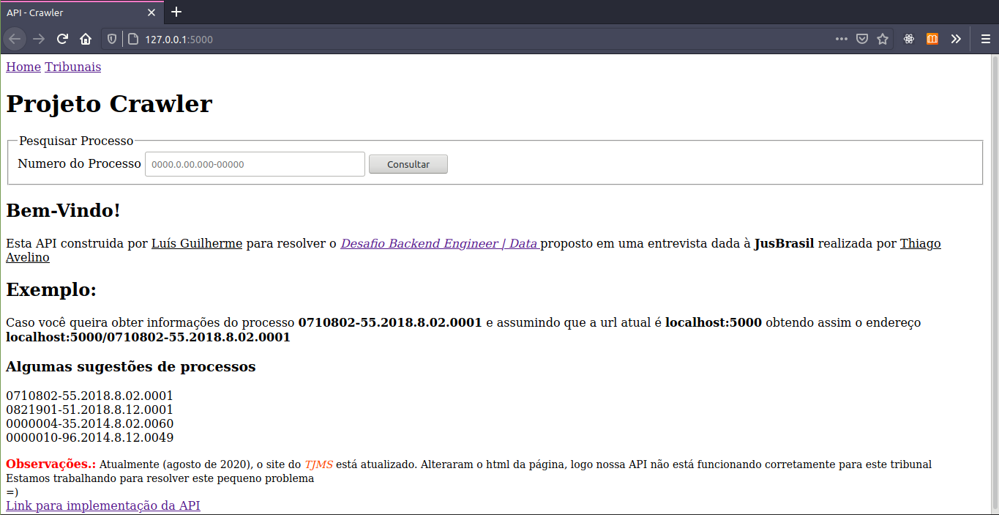
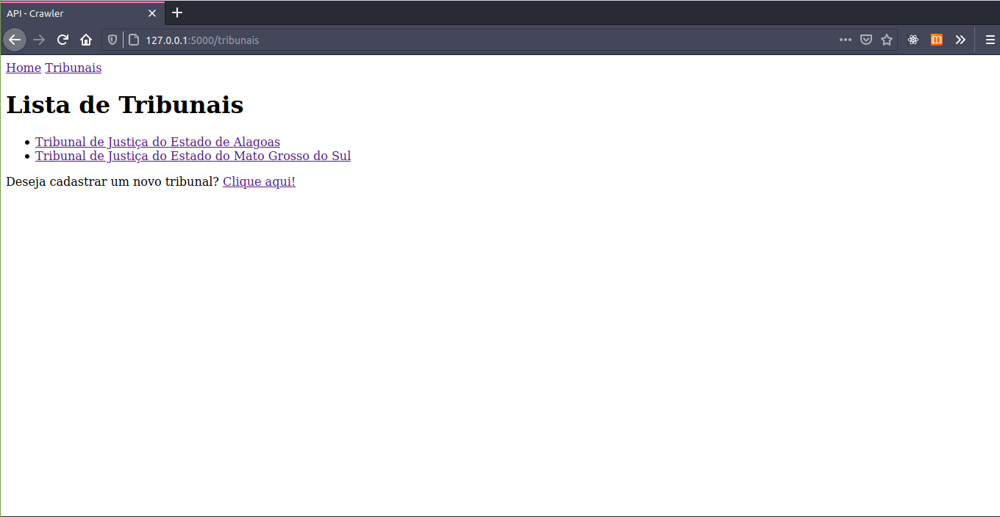
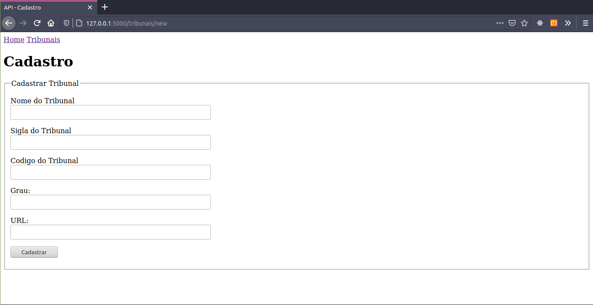
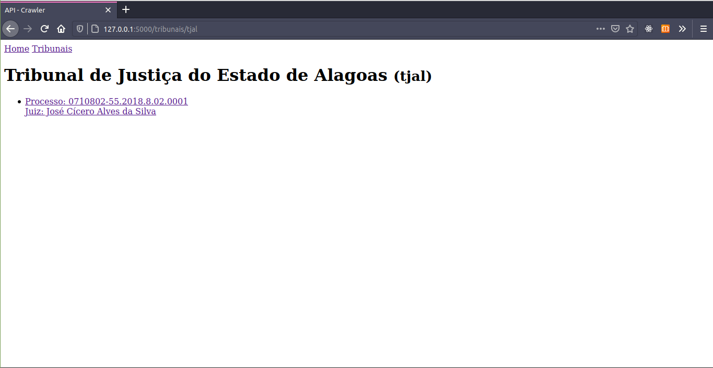
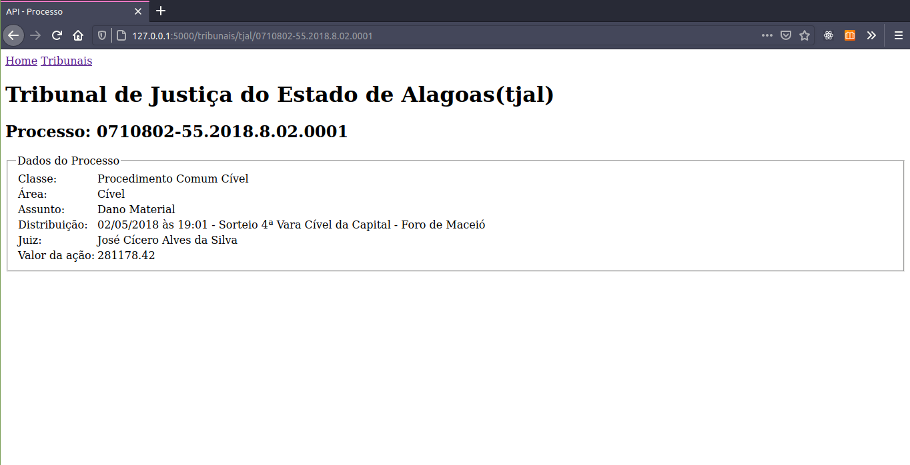

# API - Projeto Crawler
Esta API foi desenvolvida inicialmente para resolver um desafio tecnico promovido pela JusBrasil, porém co o período de pandemia meu processo seletivo.

Então resolvi colocar mais algumas funcionalidade, para demonstrar a aprendizagem que tive durante a resolução do desafio.

Aprendizado com as ferramentas: Flask, BeautifulSoup e Selenium WebDriver
## Funcionalidades
- [x]   Buscar processo na web
- [x]   Coletar dados do projeto em um JSON
- [x]   Buscar processo por número
- [x]   Cadastro de Tribunais (futuramente extender a solução para mais tribunais alem do tjal)
- [ ]   Cadastrar projetos coletados no banco (refatorando)
- [ ]   Deletar processo
- [ ]   Atualizar processo
- [ ]   Melhorar a interface da API (BootStrap)
- [ ]   Criar uma imagem Docker (para o webdriver funcionar corretamente em qualquer computador)
## Requisitos
Todos os requisitos poderam ser ignorados depois a criação da imagem Docker
### Bibliotecas:
- Numpy
- Selenium
- BeautifulSoup (bs4)
- Flask
- Flask-WTForms (flask_wtf)
- Flask-SQLAlchemy  (flask_sqlalchemy)
- Flask-Migrate (flask_migrate)
- SQLite
- Docker
### Navegador:
- Mozilla Firefox
### Arquivos:
É necessário entrar em *https://github.com/mozilla/geckodriver/releases* e baixar um geckodriver compatível com a versão do seu Firefox e extraia o arquivo na pasta **/usr/bin**
## Execução
Clone o repositório abra um terminal e execute **"flask run"**

# Layouts

